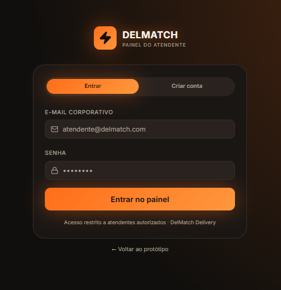
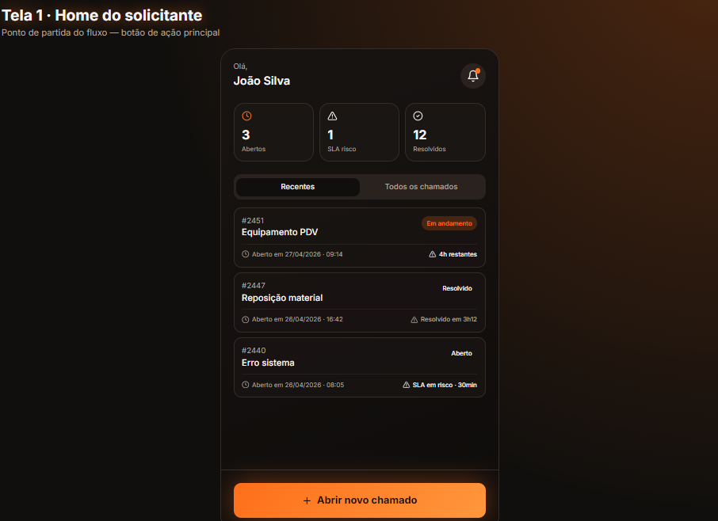
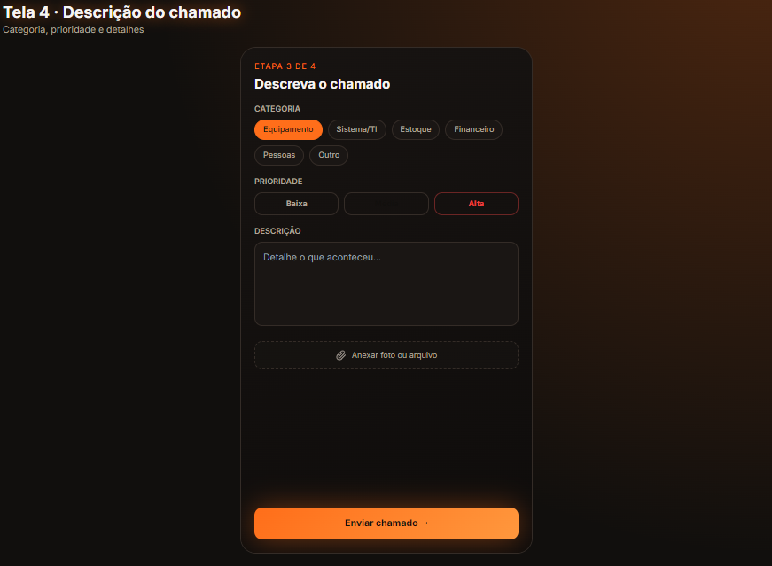
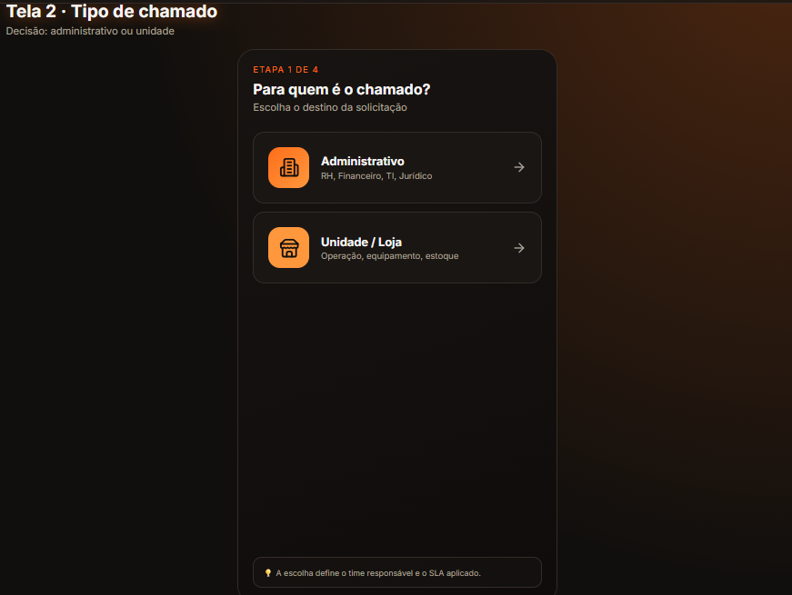
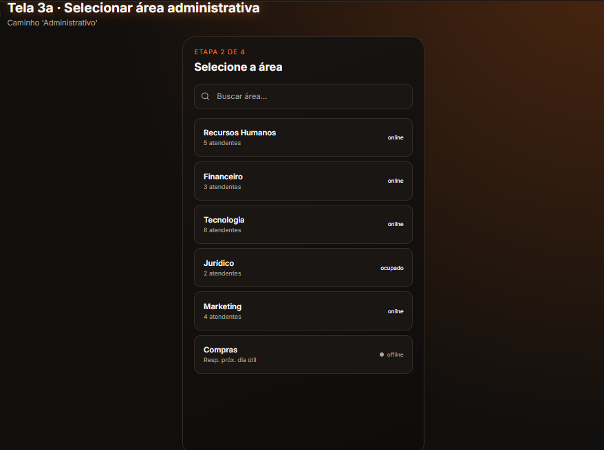
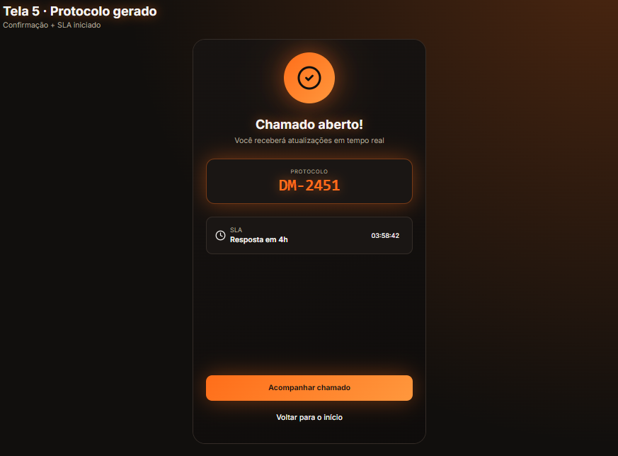
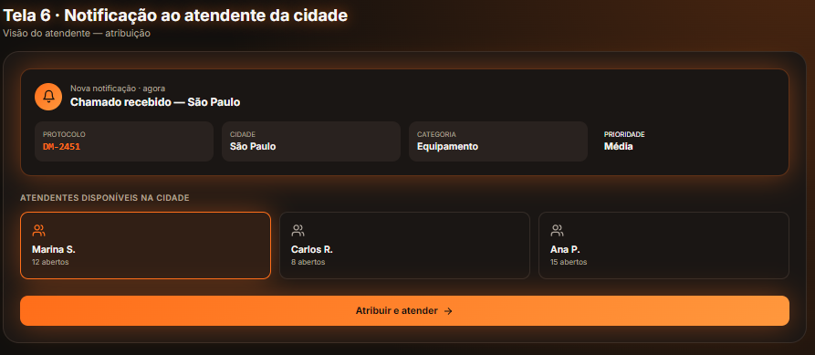
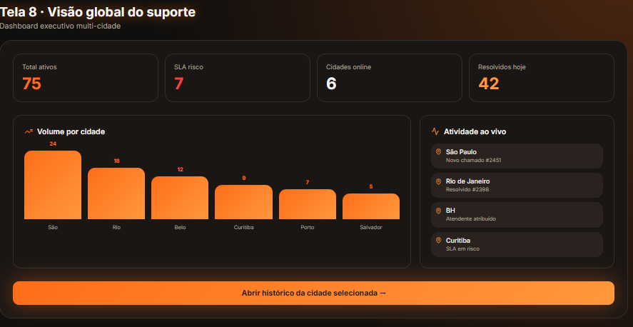
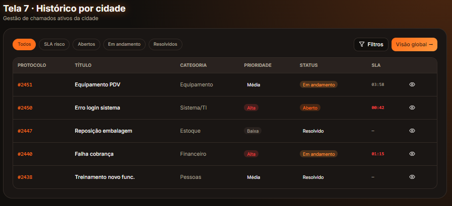

  <h1>🚀 Sistema de Gestão de Chamados (Helpdesk UI/UX)</h1>
  
Uma reformulação completa da experiência de abertura e gestão de tickets de suporte.

 

## 🎯 O Projeto

O **Sistema de Gestão de Chamados** nasceu da necessidade de modernizar e desburocratizar o fluxo de atendimento de TI/Suporte. O objetivo primário foi desenhar uma jornada fluida que reduzisse a frustração do usuário na hora de relatar um problema e, ao mesmo tempo, entregasse dados estruturados e de alta qualidade para a equipe de resolução.

---

## 👤 Meu Papel
Como **UX/UI Designer e Desenvolvedor Front-end** neste projeto, fui responsável por conduzir todo o ciclo visual: desde a ideação do fluxo e arquitetura da informação, passando pela concepção do *Design System*, até a prototipação e entrega das telas em alta fidelidade.

---

## 🧠 O Desafio de UX

Sistemas corporativos tradicionais sofrem do que chamamos de "fadiga de formulário" — telas poluídas, dezenas de campos obrigatórios e nenhuma clareza visual. O grande desafio de usabilidade era:
1. **Reduzir a Carga Cognitiva:** Fazer com que a abertura de um ticket parecesse uma conversa, não uma prova de vestibular.
2. **Prevenção de Erros:** Garantir que o usuário soubesse exatamente qual o tipo de chamado e para quem enviá-lo, evitando triagens incorretas.

---

## 💡 A Solução: Jornada Progressiva (Step-by-Step)

Para resolver a complexidade, apliquei o padrão de design **Wizard/Step-by-step**. O formulário monolítico foi "fatiado" em etapas lógicas. Essa abordagem mantém o usuário focado em uma única decisão por vez, aumentando drasticamente a taxa de sucesso e a qualidade da descrição do problema.

| Passo 1 e 2: Abertura e Tipo | Passo 3 e 4: Descrição e Atribuição |
| :---: | :---: |
|  |  |
|  |  |

> *O usuário é guiado visualmente. O contraste alto nos botões (Call-to-Action) orienta o olho diretamente para o próximo passo lógico.*

---

## ✅ Visibilidade do Status do Sistema (Heurística de Nielsen)

Um erro comum em fluxos complexos é não fornecer um feedback conclusivo. Projetamos telas de triunfo e notificação para garantir que ambas as pontas (solicitante e resolvedor) tivessem clareza do status do ticket.

| Confirmação para o Usuário | Alerta para a Gestão |
| :---: | :---: |
|  |  |
| *A tela de Protocolo age como um recibo psicológico, reduzindo a ansiedade do solicitante.* | *O administrador recebe alertas assíncronos, organizando a fila de prioridades (SLA).* |

---

## 📊 Dashboards e Gestão Macroscópica

A interface de gestão foi projetada com foco em **escaneabilidade**. Utilizando tabelas limpas e cards de status, o gestor consegue bater o olho e entender a saúde geral do atendimento.

---

## 🎨 UI & Design System

O projeto adota um *Dark Mode* estrutural, que confere um aspecto premium, tecnológico e focado.
* **Redução de Fadiga Visual:** Fundamental para administradores que passam 8 horas por dia operando o sistema.
* **Acentos em Laranja e Neon:** Usamos luz e cor como linguagem. O laranja guia a ação principal (caminho feliz), enquanto tons neon fornecem feedbacks imediatos de erro, sucesso ou alertas críticos.
* **Tipografia (Inter):** Escolhida por sua altíssima legibilidade em interfaces ricas em dados, garantindo clareza até nas menores descrições de chamados.

---

## 🚀 Impactos Esperados

* 📉 **Redução no tempo médio** de abertura de chamados.
* 🎯 **Aumento na precisão da triagem** através da categorização passo a passo.
* ❤️ **Satisfação do usuário final**, substituindo um fluxo engessado por uma experiência fluida e moderna.

---
*Prototipado com Figma | UI em React/Tailwind CSS*
